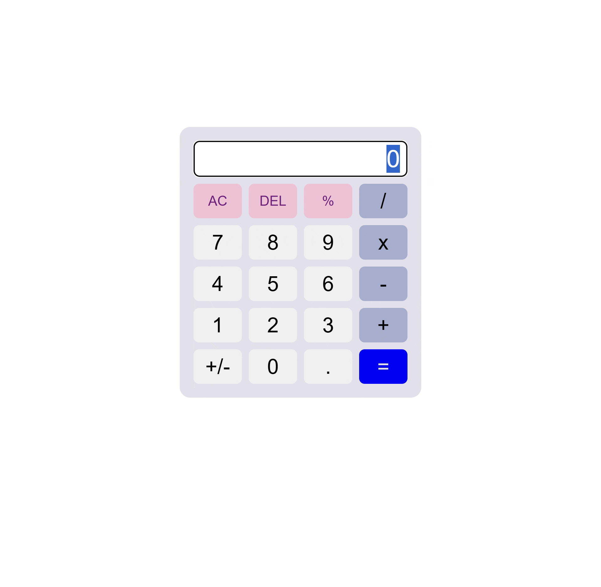

# JavaScrip Library

## JQuery

## Aplikasi Kalkulator 
Teknologi yang digunakan
1. Html
2. css eksterna use flex and grid
3. Jquery for handle DOM use replace and add inner html
4. All function but have bug when click operetor to much inser operator to much so result error

Demo
