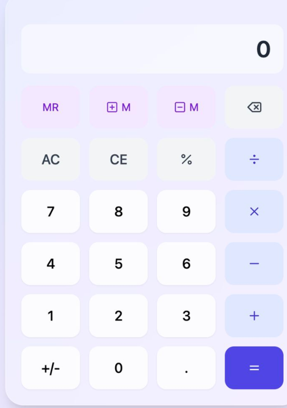
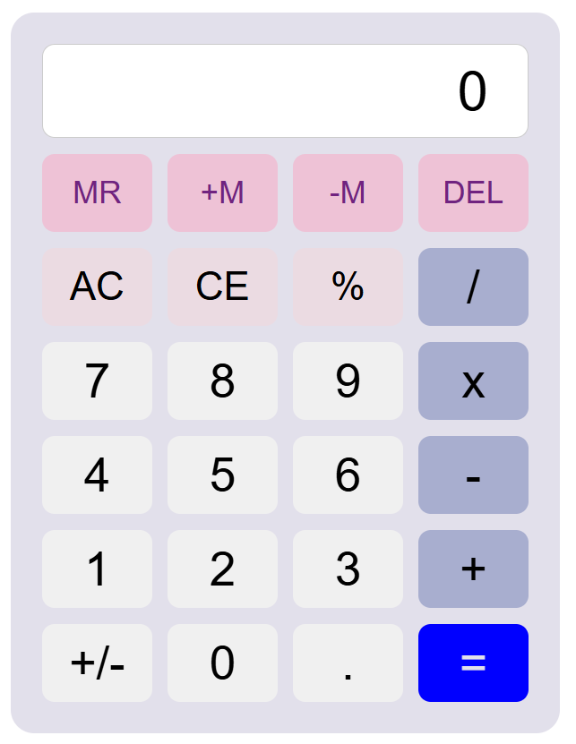

# Aplikasi Kalkulator Grid HTML & CSS

CSS

Aplikasi kalkulator menggunakan **HTML** dan **CSS Grid** responsif.

## Fitur Utama
Menggunakan grid 4 kolom.
Layar input/hasil menggunakan properti `grid-column: span 4`.
Tombol-tombol `width: 100%`
Warna Berbeda pada tombol operator help dan angka